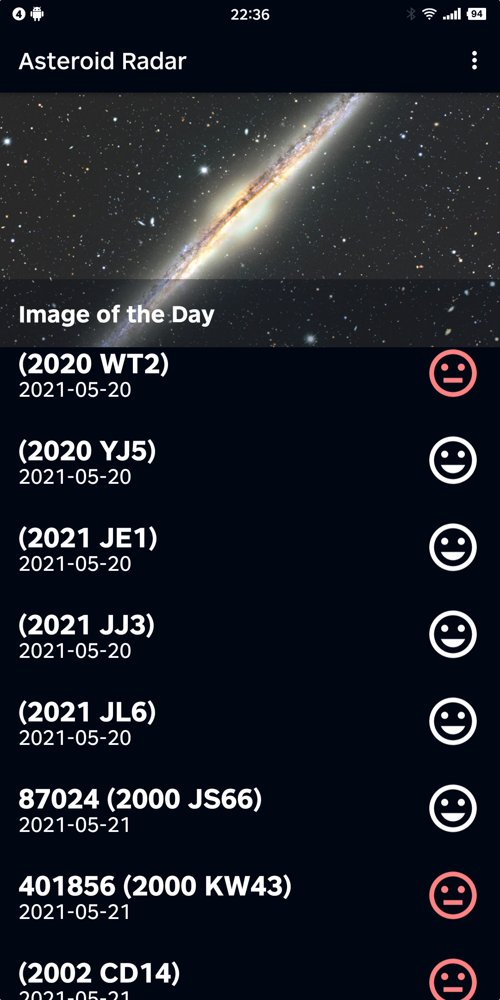
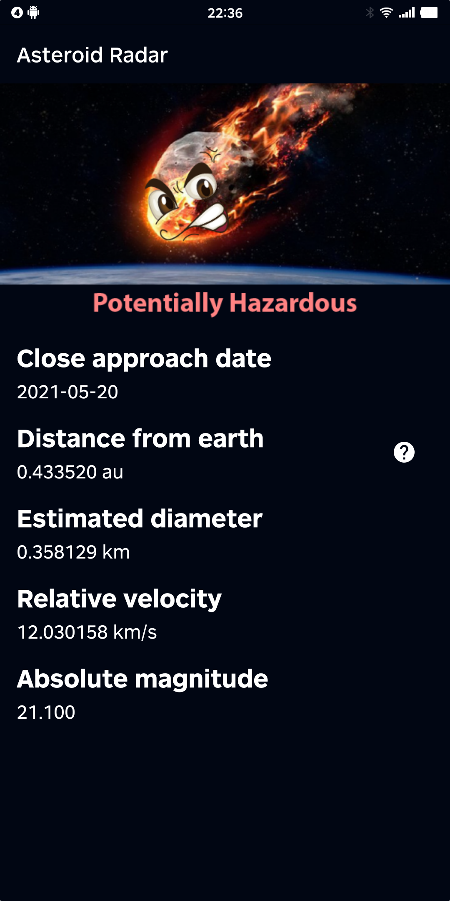
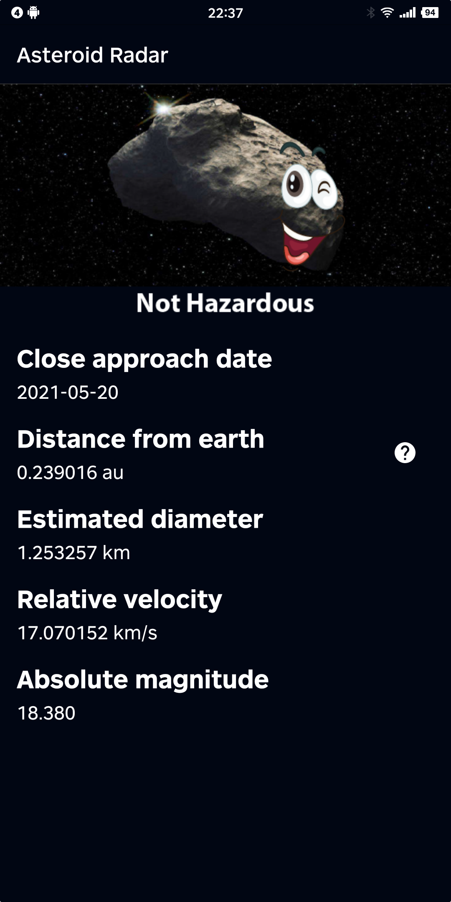
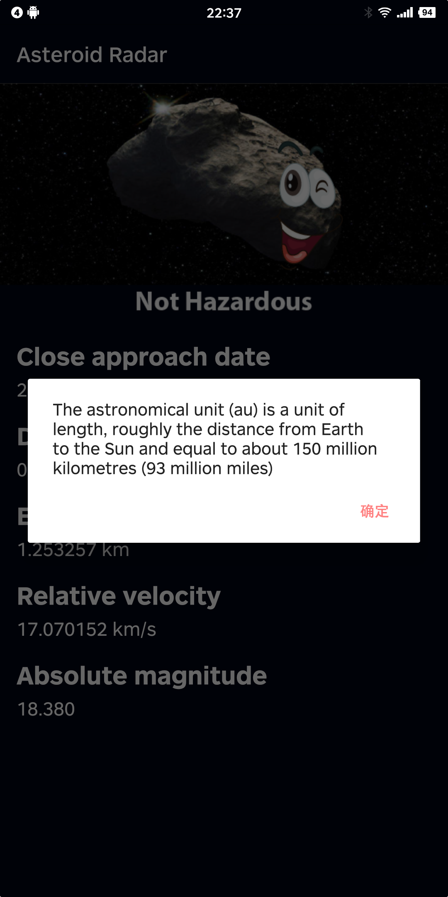

# Asteroid Radar

Asteroid Radar, born out of a [course project assignment](https://github.com/udacity/nd940-android-kotlin-c2-starter) of the [Android Kotlin Developer Nanodegree Program](https://www.udacity.com/course/android-kotlin-developer-nanodegree--nd940) from Udacity, is an app to view the asteroids detected by NASA that pass near Earth, you can view all the detected asteroids within a week of each day, their data (size, velocity, distance to Earth) and whether they are potentially hazardous.

The app consists of two screens: a Main screen with a list of all the detected asteroids and a Details screen that is going to display the data of that asteroid once it´s selected in the Main screen list. The main screen will also show the NASA image of the day.

The app utilizes kotlin coroutines to asynchronously provide the backend services, including
- Auto fetching on a daily basis the asteroids data a week starting from each day;
- Auto deleting out-dated data;
- Auto caching downloaded data into an offline database;
- Supports the Talkback accessibility tool

It uses the following packages:
- Android Room for interfacing with SQL database
- Android RecyclerView
- Android ViewModel
- Retrofit for making internet queries
- Moshi for parsing downloaded JSONs into Kotlin class objects
- Glide for managing downloading images from the internet

## Screenshots

